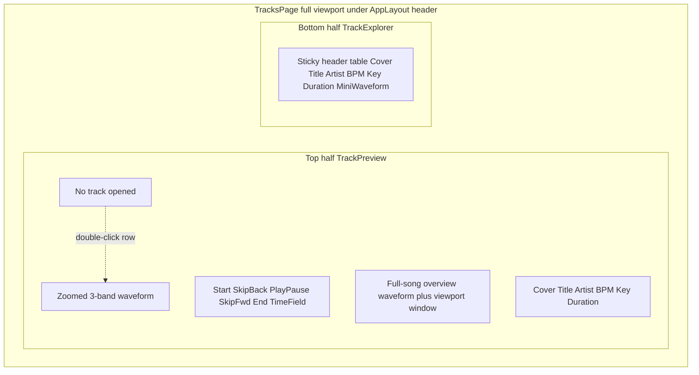

# Tracks Page Revamp (Handoff Spec)

Implementation spec for the Rekordbox-style `/tracks` page. Work the TODOs in order unless a later item is blocked. **Check items off in this file as you go** so another agent can resume from here.

## Goals

Rekordbox-like **Tracks** page:

- **Top half:** currently opened track (waveform + transport + overview + metadata). If none opened, centered text: `No track opened`. Open by **double-clicking** a library row.
- **Bottom half:** flat library table (no folders) of every user track.

Visual target: dense, dark DJ-software chrome (Rekordbox), not the current cream “song pool” card. Keep the existing app header from [`frontend/src/components/layout/AppLayout.tsx`](../frontend/src/components/layout/AppLayout.tsx), but let this route use the full remaining viewport (drop `max-w-6xl` / `max-w-4xl` wrapping for `/tracks`).

## Current code (do not treat as the target UI)

[`frontend/src/pages/tracks/TracksPage.tsx`](../frontend/src/pages/tracks/TracksPage.tsx) is still the old song-pool card: upload, local title/artist edits (not persisted), delete, drag-reorder. There is **no** play, waveform, musical key, or `PATCH`.

Relevant stack today:

- Types: [`frontend/src/lib/types/track.ts`](../frontend/src/lib/types/track.ts) — `title`, `artist`, `bpm`, `duration` (string), `cover`, `url`. **No `key`.**
- API client: [`frontend/src/lib/api/TrackAPI.ts`](../frontend/src/lib/api/TrackAPI.ts) — `list`, `upload`, `delete` only.
- Metadata parse: [`frontend/src/lib/audio/trackMetadata.ts`](../frontend/src/lib/audio/trackMetadata.ts) — `music-metadata`; no TKEY/`common.key`.
- Backend model: [`backend/internal/domain/track/track_model.go`](../backend/internal/domain/track/track_model.go) — no Key, no waveform peaks, no Update.
- Routes: [`backend/internal/http/router.go`](../backend/internal/http/router.go) — `GET /tracks`, `POST /tracks/upload`, `DELETE /tracks/:id`.
- Audio files live on S3 with public-style URLs ([`backend/internal/storage/s3.go`](../backend/internal/storage/s3.go)). **Decoding in the browser requires CORS or an authenticated proxy.** Assume bucket CORS is not enough; add a backend stream/presign path.

## Locked product decisions

- **Key:** parse ID3 `TKEY` / `music-metadata` `common.key` on upload; else empty string. **User-editable.** No automatic key detection.
- **Persist edits:** Title, Artist, BPM, Key via `PATCH /tracks/:id`. Cover and Duration are **not** editable.
- **Open:** double-click a ready row. Single click only selects (highlight). No folders.
- **Skip back/forward:** **10 seconds**.
- **Time field:** `m:ss` or `m:ss.cc` (centiseconds optional). Commit on Enter/blur; invalid input reverts. Seeking updates playhead.
- **Drag-reorder:** drop it on this page (library table, not a queue).
- **Delete + upload:** keep (toolbar and/or row action). Upload stays in the explorer header.

## Layout

- Vertical split ~50/50; optional drag handle later, not required for v1.
- Preview and explorer are independent scroll regions. Explorer body scrolls vertically; header row stays pinned. Table can scroll horizontally; header and cells stay in column lockstep (one shared horizontal scroll container, sticky thead).

### Column resize

Resizable: Title, Artist, BPM, Key, Duration (and any extra text columns).

**Not** resizable: Cover, mini waveform.

Persist widths in `localStorage` key `dj-sim.tracks.columnWidths`.

### Metadata row (opened track)

Same fields as the table. Cover image (or initials via existing [`SongCover`](../frontend/src/pages/home/SongCover.tsx)) not editable. Duration not editable. Title/Artist/BPM/Key editable; debounce ~400ms then `PATCH`; also save on blur. Optimistic UI; on failure revert + show error on the row/field.

## Waveform (Rekordbox RGB)

Rekordbox-style **single** waveform whose color at each x is mixed from three bands:

- **High** orange (~`#ff7a18`)
- **Mid** white (~`#f4f4f4`)
- **Low** blue (~`#3b82f6`)

Implementation (no wavesurfer): custom canvas.

1. Decode to `AudioBuffer`.
2. Mix to mono.
3. IIR/biquad split: low `< ~250 Hz`, mid `250 Hz–4 kHz`, high `> ~4 kHz`.
4. Downsample to peak/RMS columns. Store `{ lows, mids, highs }` as `Float32Array` (or packed JSON for overview).
5. Draw filled mirrored waveform; each column color = RGB mix of the three band energies (normalize per column so it stays bright).

**Two resolutions:**

| Use | Resolution | When computed | Where stored |
| --- | --- | --- | --- |
| Table mini + preview overview | ~1000–2000 columns | Upload (client already reads the file) and lazily for **existing** tracks missing data | Postgres JSON on `tracks.waveform_overview` |
| Zoomed preview | Higher res from full decode (~px * zoom, cap e.g. 8k–16k columns) | On open | Memory (and optional IndexedDB cache keyed by track id) — not required in DB for v1 |

**Zoomed view:** horizontal zoom (wheel over waveform; pinch if easy) and pan (drag, shift+wheel, or scrollbar). Playhead stays visible: while playing, autoscroll so the playhead stays in the middle third.

**Overview:** full-song flattened RGB strip. Overlay a viewport rectangle matching the zoomed window. Click/drag overview to seek and/or move the viewport.

Click/drag on the zoomed waveform seeks.

## Playback

- Fetch audio through **authenticated** `GET /tracks/:id/audio` (proxy from S3) or a short-lived **presigned GET**. Prefer proxy if CORS/presign is messy; either is fine if the browser can `fetch` + play.
- Use one blob URL: `<audio>` for transport **and** `decodeAudioData` for hi-res peaks.
- Space toggles play/pause when focus is not in an input.
- Opening another track stops the previous one.
- Unopened state: no audio.

Player state lives in a hook e.g. `useTrackPlayer` (opened id, status, currentTime, durationSeconds, zoom, scrollPx).

## Backend changes

[`track.Track`](../backend/internal/domain/track/track_model.go):

- `Key string` `json:"key"`
- `WaveformOverview` JSON (`json:"waveformOverview"`) — `{ "lows": number[], "mids": number[], "highs": number[] }` (and optional `durationSeconds`)
- Keep `Duration` string for display; player should prefer `audio.duration` when loaded

New/updated endpoints (all auth + `RequireUser`, same as existing):

- `PATCH /tracks/:id` — body `{ title?, artist?, bpm?, key?, waveformOverview? }`. Never accept cover/duration/url from client for this patch.
- `GET /tracks/:id/audio` — stream object for the owning user (Content-Type from upload; `Accept-Ranges` if reasonably doable).

Wire: repository `Update`, service `Update`, handler methods, router. GORM AutoMigrate will pick up new columns (confirm where migrate runs today — [`backend/internal/storage/postgres.go`](../backend/internal/storage/postgres.go) / main).

Upload already accepts title/artist/bpm/duration/cover; also accept `key` and `waveformOverview` from the client FormData.

## Frontend structure (suggested)

Keep [`TracksPage.tsx`](../frontend/src/pages/tracks/TracksPage.tsx) as the composer. Split:

- `frontend/src/pages/tracks/TrackPreview.tsx`
- `frontend/src/pages/tracks/TrackExplorer.tsx`
- `frontend/src/pages/tracks/TransportControls.tsx`
- `frontend/src/pages/tracks/WaveformCanvas.tsx` (zoomed + overview + mini via props)
- `frontend/src/pages/tracks/useTrackPlayer.ts`
- `frontend/src/pages/tracks/useTrackLibrary.ts` (list/upload/delete/patch; replace inlined `useEffect` from current page)
- `frontend/src/lib/audio/threeBandWaveform.ts`
- Extend [`trackMetadata.ts`](../frontend/src/lib/audio/trackMetadata.ts) with key parse
- Extend [`PoolTrack` / `Track`](../frontend/src/pages/home/types.ts) with `key` + `waveformOverview`
- [`TrackAPI.ts`](../frontend/src/lib/api/TrackAPI.ts): `updateTrack`, `trackAudioUrl` or blob fetch helper
- [`api.ts`](../frontend/src/config/api.ts) routes
- [`useTrackUpload.ts`](../frontend/src/pages/home/useTrackUpload.ts): send key + overview peaks

Reuse existing shadcn `Button`. Dense table: native `<table>` or a grid with explicit column widths — **not** the current card list.

## CORS / audio fetch

`<audio src={track.url}>` against raw S3 will likely fail for analysis (`fetch`/`decodeAudioData`). Do not depend on public S3 GET. Always play/analyze via the authenticated audio endpoint (axios/fetch with Clerk token, blob URL).

## Out of scope

Folders, cues/beatgrid, automatic key/BPM analysis, Studio wiring, wavesurfer, drag-reorder, broadcast.

## Verification

- Browser: empty preview copy; double-click opens; play/pause/skip/start/end; edit time seeks; zoom/pan; overview click; edit title/artist/bpm/key and reload to confirm persist; cover/duration cannot edit; column resize + sticky header + horizontal scroll; mini waveforms on rows; upload still works; delete still works.
- If no browser MCP: `curl` PATCH/GET audio with auth as fallback and say so.

---

## TODOs (execution checklist)

Check these off as work lands.

### 0. Spec in repo

- [x] **0.1** Write this document to `docs/tracks-page.md` (including this TODO list). Future agents read that file first.

### 1. Backend: schema + update + audio

- [x] **1.1** Add `Key` and `WaveformOverview` (JSONB/text JSON) to `track.Track`; confirm AutoMigrate.
- [x] **1.2** Repository: `Update(ctx, userID, id, fields)` — only owner; ignore unknown/forbidden fields.
- [x] **1.3** Service + handler `PATCH /tracks/:id` (title, artist, bpm, key, waveformOverview).
- [x] **1.4** Handler `GET /tracks/:id/audio` streams S3 object for owner; set content type; 404/403 if missing/not owner.
- [x] **1.5** Upload: accept `key` + `waveformOverview` FormData; persist on create.
- [x] **1.6** Router: register PATCH and GET audio next to existing track routes.
- [x] **1.7** Compile `go` backend; add focused tests if the repo already tests handlers/repos (follow existing style; do not add a new test framework).

### 2. Frontend API + types + metadata

- [x] **2.1** Extend `Track` / `PoolTrack` with `key` and `waveformOverview`.
- [x] **2.2** `TrackAPI.updateTrack`; list/upload types include new fields.
- [x] **2.3** `TrackAPI` helper to fetch audio as `Blob` (auth headers via existing axios client).
- [x] **2.4** Parse musical key in `readTrackMetadata` (`common.key`, native TKEY/INITIALKEY).
- [x] **2.5** On upload, compute overview peaks in `threeBandWaveform.ts` from the local `File`/`AudioBuffer` and send with `uploadTrack`.

### 3. Waveform engine

- [x] **3.1** `computeThreeBandPeaks(buffer, columnCount)` → `{ lows, mids, highs }`.
- [x] **3.2** `drawRgbWaveform(canvas, peaks, viewStart, viewEnd, playhead, options)` — Rekordbox-style RGB mix, mirrored fill, playhead line.
- [x] **3.3** Overview + mini variants (no zoom; optional playhead/viewport rect).
- [x] **3.4** Cache hi-res peaks in memory by track id; revoke blob URLs on close/unmount.

### 4. Preview / player UI

- [x] **4.1** Empty state: `No track opened`.
- [x] **4.2** `useTrackPlayer`: load blob, audio element, play/pause, currentTime rAF, seek, skip ±10s, start/end, zoom/pan state.
- [x] **4.3** Zoomed waveform: wheel zoom, drag pan, click seek, autoscroll while playing.
- [x] **4.4** Transport controls + editable current time.
- [x] **4.5** Overview strip linked to zoom viewport + seek.
- [x] **4.6** Metadata strip: cover/duration locked; title/artist/bpm/key patch with debounce.

### 5. Explorer table

- [x] **5.1** Replace card list with Rekordbox-like dark table: Cover, Title, Artist, BPM, Key, Duration, MiniWaveform.
- [x] **5.2** Sticky header; vertical scroll body; horizontal scroll for overflow.
- [x] **5.3** Column resize (except cover + waveform); persist widths.
- [x] **5.4** Single-click select; double-click open (ignore uploading/error rows).
- [x] **5.5** Toolbar: upload + track count; row delete; keep upload hook.
- [x] **5.6** If `waveformOverview` missing on old tracks: show empty mini-wave; optional later backfill via PATCH after decode (nice-to-have, not blocking).

### 6. Page chrome

- [x] **6.1** `TracksPage` split layout (top preview / bottom explorer) filling viewport under header.
- [x] **6.2** `AppLayout`: do not clamp `/tracks` to `max-w-6xl`; keep other routes as they are.
- [x] **6.3** Remove drag-reorder from this page (`useListItemMove` unused here).

### 7. Verify + cleanup

- [x] **7.1** Browser-verify flows in Verification above; fix regressions (upload/delete/auth empty list).
- [x] **7.2** No leftover song-pool card styles on `/tracks`. Home/Studio/Skills unchanged.
- [x] **7.3** Update `docs/tracks-page.md` checkboxes to match what shipped; note leftover follow-ups at the bottom.

## Suggested agent order

One agent can do **0 → 1** (backend) then **2–7** (frontend). If split: Agent A owns **0–1.7**; Agent B starts at **2.1** assuming PATCH + audio GET exist. Do not start UI playback until **1.4** works.

## Follow-ups (after ship)

- **Lazy waveform backfill:** old tracks without `waveformOverview` show an empty mini-wave; optional `PATCH` after decode on open was deferred (5.6).
- **HTTP Range:** `GET /tracks/:id/audio` sets `Accept-Ranges: bytes` but still streams the full S3 object. Playback uses an authenticated blob URL, so in-browser seek does not depend on Range.
- **Browser MCP:** this session had no browser automation tools. Verified `tsc -b`, Go handler/storage tests, `/health`, and that Vite is serving the new `/tracks` modules (empty state, explorer table, full-viewport `AppLayout`). Sign-in playback/upload/PATCH still needs a manual pass in the app.
